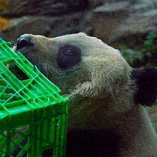
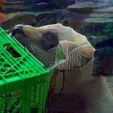
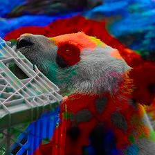
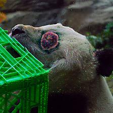
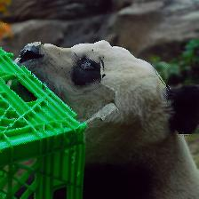

# Bounded Adversarial Attack on Deep Content Features (CVPR 2022)

## Introduction


In this paper, we propose an adversarial attack which achieves the STOA trade-off between attack success rate and naturalness of adversarial samples. 

We find the scalability issues of $L_p$-norm bounded adversarial attacks. For an successful attack, its bound value needs to increase significantly. While the increased the bound size decrease the quality of adversarial samples non-trivially. Similar findings holds for recent feature-related attacks. So we ask the following question: "How should we define a bound which can balance the trade-off between successful rates and imperceptible property of adversarial samples?". 

To this end, we show that we can leverage the rich information embedded in the intermediate representations for better bound. We model the intermediate representation of neural networks as a marginal distribution from the input to the real domain. And we propose to quantile bounds to define on such distributions. More details could be found in the paper.

## Examples

Here we list some of the examples from different algorithm. More samples can be found in the directory "samples". The analysis over the trade-off of naturalness and success rate can be found in the Paper.

|             D2B 40 (Ours)             |                BIM 8                 |                FS 2                 |
| :-----------------------------------: | :----------------------------------: | :---------------------------------: |
|  |  |  |

|                SM 500                 |                  HotCold                  |              Spatial               |
| :-----------------------------------: | :---------------------------------------: | :--------------------------------: |
|  |  |  |

    ## Plan 

I will be releasing the implementation for other baselines soon. 

## Test Environment:
- Ubuntu 16.04 / Windows 10
- Python 3.6

## Dependency

- tensorflow-gpu==1.15
- numpy
- matplotlib
- lmdb
- tensorpack
- pillow
- opencv-python
- filelock
- tqdm

## Step-by-step Tutorial

1. Download the Imagenet dataset. Put its train, eval and test folder under sub-directory "./code/imagenet".

2. Download the following models. You could selectively download some of them for testing. Note that VGG16 is a necessary model for the success of this demonstration. Put the files under the folder "checkpoints" after decompression:
- VGG16 : https://github.com/machrisaa/tensorflow-vgg 
- ResNetV1-50 : https://github.com/tensorflow/models/tree/master/research/slim
- ResNet152-Adv : https://github.com/facebookresearch/ImageNet-Adversarial-Training
- The other models like MobileNet, DenseNet and VGG19 will be automatically downloaded through keras.

3. Run the following command to preprocess the dataset into a fast-reading LMDB database. This step will take hours depending on your hardware.
   
> python ./dataset/imagenet_hdd_preload.py 

4. Run the following command to initialize the internal statistics of corresponding models. This step will take 2-3 hours.
   
> python ./attack_init_statistics.py --model="Imagenet_VGG16_AVG" --internal  

5. Run the following command to generate the adversarial samples under folder "samples". Replace XX in to the XX in your chosen attack setting D2B-XX. e.g. if you want to get the result of D2B-40, replace XX to 40. Replace the model_name by the model name you would like to test. Use --help to check which model_name is supported.

> python ./attack_mult_planes.py --task="Attack" --model="model_name" --internal --scale=0.04 --pgdpercent=0.XX --feature_smooth=10 --stat="neuron_gaussian" --targetlayer="[0,1,2]" --images="samples"

## Citation

If you find the code or the work beneficial, please remember to cite us.

```
@InProceedings{Xu_2022_CVPR,
    author    = {Xu, Qiuling and Tao, Guanhong and Zhang, Xiangyu},
    title     = {Bounded Adversarial Attack on Deep Content Features},
    booktitle = {Proceedings of the IEEE/CVF Conference on Computer Vision and Pattern Recognition (CVPR)},
    month     = {June},
    year      = {2022},
    pages     = {15203-15212}
}
```

